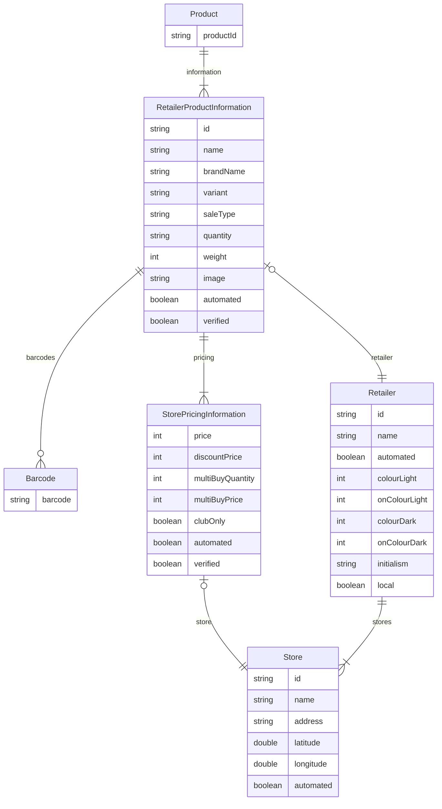

# Discount Detective

## Introduction

Discount Detective is a price comparison app for food and other essential products.

We compare prices from all of the major New Zealand supermarkets, along with a selection of local
retailers in some areas. Currently the app is only available in Dunedin, although we plan to add
support for the bigger supermarkets, and some local shops, in other regions soon.

You can search products, find the lowest prices, both at non-local and local stores and see what
local stores have in stock, so you can shop local. We also have support for adding items to a
shopping list, to make your shop more convenient.

## Compilation & Running

To run the app on your device, click the run button in Android Studio in the toolbar. Make sure the
dropdown is set to "app" to ensure you are running the proper app (rather than the scraper app).

For emulators, any phone emulator running API level 32 is recommended.

When evaluating the app, it is strongly recommended that you wait until the "app is currently
processing" message goes away. This means you'll see the true performance and behavior of the
search, however, there is a fallback search technique that can be used during this optimisation.
Additionally, the app will be slower to run during this indexing. The indexing takes around 10
minutes on a physical device, but only needs to run on the first run.

## Technical Details

This app is split into four modules, which are documented below (if you are viewing this on
the [documentation](https://sheasmith.github.io/COSC345-Project) page).

For the app, we are using Jetpack Compose (a SwiftUI analogue for Android) for the UI, along with
the Google recommended clean architecture. This means we follow a reasonably strict MVVM (Model,
View, ViewModel) pattern for the app, with all data retrieval code stores in repositories, which map
to the models, which are then processed by the ViewModel for state management and to pass to the UI.

For the search, we are using Google's AndroidX AppSearch library. We pull down a list of all
products from Firebase Realtime Database (our backend), which is then indexed by AppSearch to allow
for performant searching on products, once processed. We process search results once per hour, but
only update them if there has been a change.

The scraping of the supermarket data is done by a special app build, in the `scraperapp` module.
This is run once per day on a dedicated device, and extracts the data from each supermarket, groups
matching products together, and then uploads it to the Firebase database.

## (Hopefully) Interesting Details

### App Icon

The app icon for this app is actually generated by DALL-E 2, the OpenAI image generation project. We
then slightly modified its design to suit the requirements of Android app icons, but for the most
part, it is purely what was generated by the AI.

This was a reasonably iterative process, as we needed to be specific with our prompt, and tweak the
app icon design as we felt necessary. For example, here is a sample of some of the requests we made:

### Search Library

As part of our work integrating Google's AppSearch into our app, we discovered a bug related to
nested indexing (which was necessary for our app, as we search across products, but each product has
nested information), as such
we [reported this bug](https://issuetracker.google.com/issues?q=componentid:1012737). However, as
this functionality was critical for our app, and there no immediate acknowledgement from Google
about the bug, we submitted
a [pull request](https://android-review.googlesource.com/c/platform/frameworks/support/+/2175315) to
Google to fix the issue, which was accepted and merged in.

## Data Structure

The fundamental philosophy for the data structure is that the scraper shouldn't take any
authoritative position on what data is accurate or not (e.g. by having a product with information
from just a specific retailer). Instead the decision about which retailers data to display should be
left to the app, as it can be context specific. For example, in the shopping list screen, you would
always want to show the data for the store that the user has selected, regardless of the quality of
that data relative to other shops.

For this reason, we essentially store the original data records for each supermarket, with each
product solely having a product ID for organisation purposes.